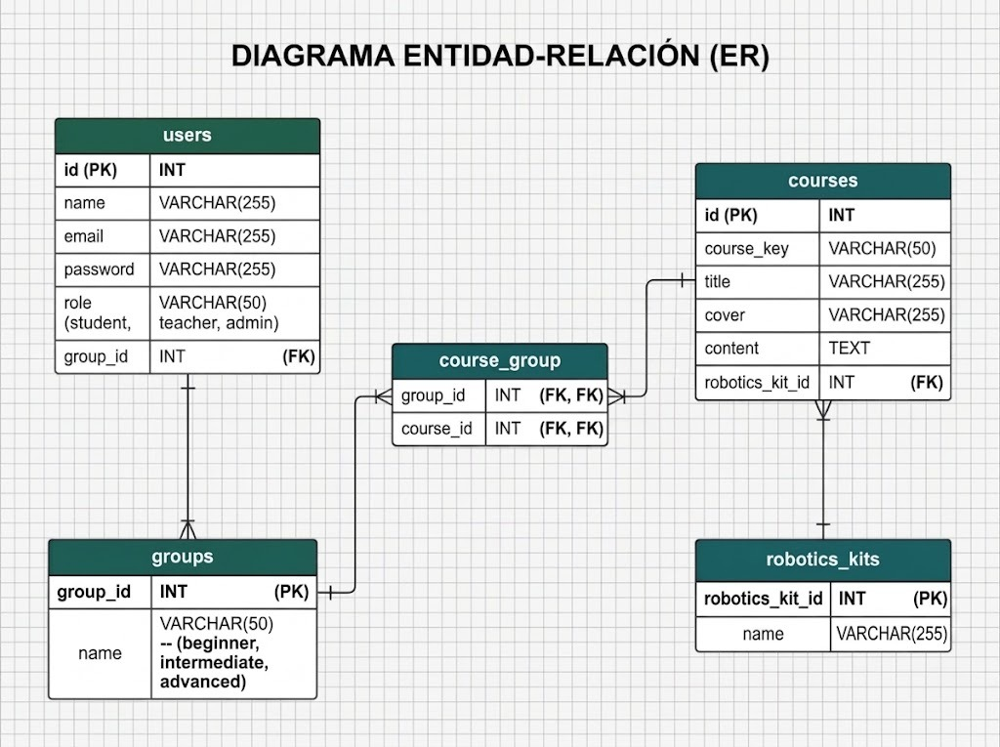

# Robotics School Platform

## Project Description

Robotics School Platform is a Laravel 7 project designed for a small robotics school.

The system manages users with different roles such as students, teachers, and administrators. Students can belong to groups, and groups can have courses assigned to them.

Courses contain information such as a title, course cover, content, and didactic material or robotics kit.

The project uses Eloquent ORM to manage the relationships between the different entities of the system.

## Main Entities

- Users
- Groups
- Courses
- Materials

## Database Test Data

The database includes test data generated using Laravel seeders and factories:

- 3 groups: Beginner, Intermediate, and Advanced.
- 3 users: Administrative, Teacher, and Student.
- 3 robotics kits.
- 100 courses generated using Faker.

## ER Diagram

The following diagram represents the entities and relationships used in the project.

